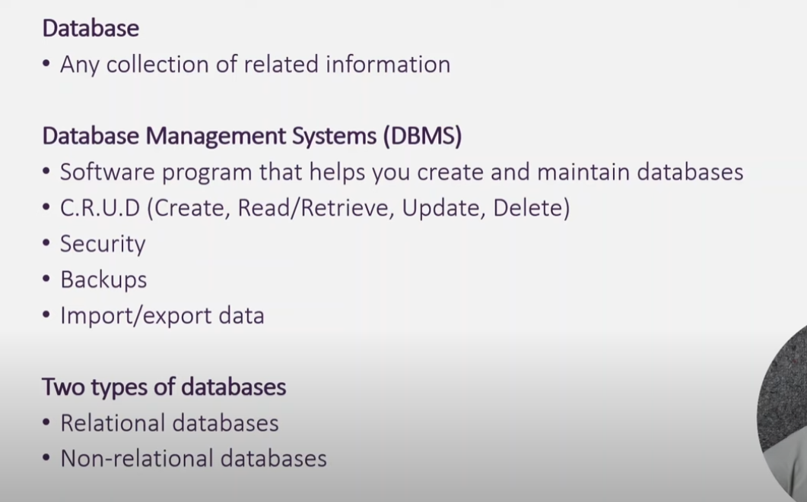
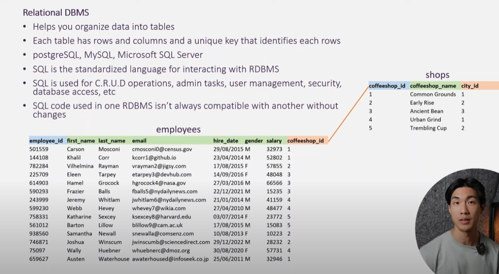
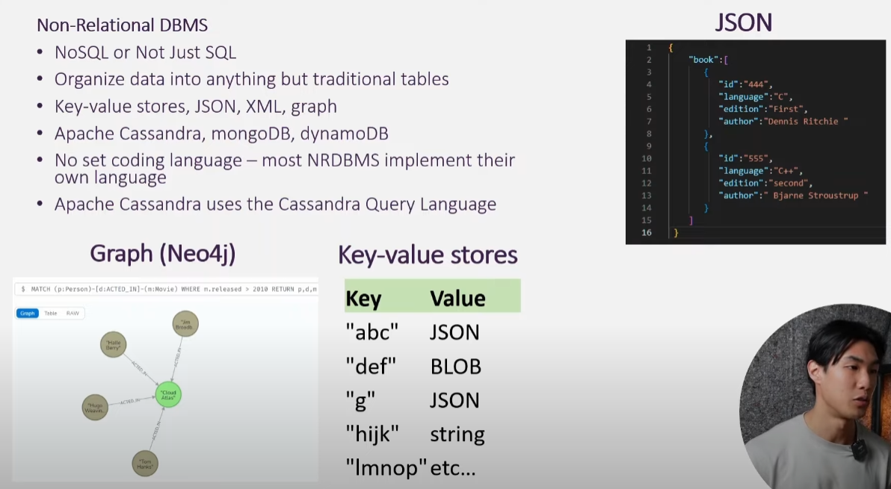
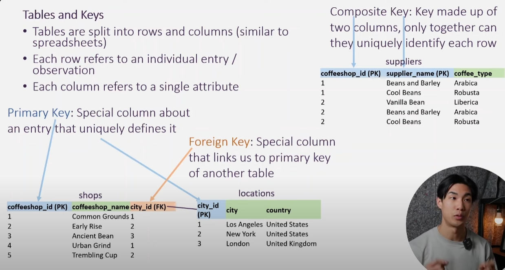

# Notas de Estudo sobre Bancos de Dados

## O que é um Banco de Dados?

Um **banco de dados** é uma coleção organizada de dados, geralmente armazenada e acessada eletronicamente por meio de um sistema de computador. Ele é projetado para gerenciar grandes quantidades de informações de forma eficiente, permitindo armazenar, recuperar, atualizar e excluir dados de maneira estruturada. Bancos de dados são fundamentais para aplicações como sites, sistemas empresariais e análises de dados.

- **Características Principais**:
  - Os dados são armazenados em um formato estruturado (ex.: tabelas, documentos ou grafos).
  - Permite consultas para recuperar dados específicos.
  - Garante integridade, consistência e segurança dos dados.
 


---

## Tipos de Sistemas de Gerenciamento de Bancos de Dados (DBMS)

### Banco de Dados Relacional (RDBMS)

Um **Sistema de Gerenciamento de Banco de Dados Relacional (RDBMS)** organiza os dados em **tabelas** com linhas e colunas, onde cada tabela representa uma entidade específica (ex.: clientes, pedidos). Cada tabela possui uma **chave primária** (um identificador único para cada linha) para garantir a unicidade dos dados, e as relações entre tabelas são estabelecidas por meio de **chaves estrangeiras**.

- **Características Principais**:
  - Armazena dados em tabelas com um esquema predefinido.
  - Usa **SQL** (Structured Query Language, ou Linguagem de Consulta Estruturada) para consultar, criar, atualizar e excluir dados (operações CRUD).
  - Garante a integridade dos dados com restrições (ex.: chaves primárias, chaves estrangeiras, restrições de unicidade).
  - Exemplos: PostgreSQL, MySQL, Microsoft SQL Server, Oracle Database.
  - **Vantagens**: Estruturado, confiável para consultas complexas, suporta transações (propriedades ACID: Atomicidade, Consistência, Isolamento, Durabilidade).
  - **Desvantagens**: Menos flexível para dados não estruturados, pode ser mais lento para grandes volumes de dados não estruturados.

**Exemplo**:
Imagine um banco de dados de uma cafeteria:
- Tabela `shops` (lojas): Armazena detalhes das cafeterias (colunas: `coffeeshop_id`, `coffeeshop_name`, `city_id`).
- Tabela `employees` (funcionários): Armazena detalhes dos funcionários (colunas: `employee_id`, `first_name`, `last_name`, `coffeeshop_id`).
- O `coffeeshop_id` na tabela `employees` é uma chave estrangeira que se conecta à tabela `shops`.




---

### Banco de Dados Não Relacional (NoSQL)

Um **Sistema de Gerenciamento de Banco de Dados Não Relacional (NoSQL)**, ou "Não Apenas SQL", é projetado para lidar com dados não estruturados, semiestruturados ou estruturados, sem a estrutura rígida de tabelas dos RDBMS. Bancos NoSQL são altamente escaláveis e flexíveis, ideais para big data, análises em tempo real e aplicações modernas.

- **Características Principais**:
  - Suporta diferentes modelos de dados: chave-valor, documento (JSON, XML), colunar ou grafo.
  - Não possui esquema fixo — dados podem ser adicionados dinamicamente.
  - Exemplos: MongoDB (documento), Apache Cassandra (colunar), Neo4j (grafo), Redis (chave-valor).
  - **Vantagens**: Escalável, flexível para dados não estruturados, mais rápido para certas cargas de trabalho (ex.: leituras/escritas em grande escala).
  - **Desvantagens**: Menos consistência (consistência eventual em alguns casos), não possui uma linguagem de consulta padronizada.
  - Muitos bancos NoSQL implementam suas próprias linguagens de consulta (ex.: Apache Cassandra usa CQL – Cassandra Query Language).

**Exemplos de Modelos de Dados**:
- **Chave-Valor**: Um par chave-valor simples, ex.: `"abc": JSON`, `"def": BLOB`.
- **Documento (JSON)**: Armazena dados como documentos JSON, ex.: `{"id": "444", "language": "C", "author": "Dennis Ritchie"}`.
- **Grafo (Neo4j)**: Representa dados como nós e relacionamentos, útil para redes sociais ou sistemas de recomendação.




---

## Tabelas e Chaves em Bancos de Dados Relacionais

### Entendendo Tabelas
- Tabelas são a estrutura principal em RDBMS, semelhantes a planilhas.
- Cada **linha** representa um registro ou entrada (ex.: uma cafeteria ou funcionário).
- Cada **coluna** representa um atributo dessa entrada (ex.: nome, ID, localização).

### Tipos de Chaves
- **Chave Primária (PK)**: Um identificador único para cada linha em uma tabela. Não pode haver duas linhas com o mesmo valor de chave primária.
  - Exemplo: Na tabela `shops`, o `coffeeshop_id` é a chave primária.
- **Chave Composta**: Uma chave formada por duas ou mais colunas que, juntas, identificam uma linha de forma única.
  - Exemplo: Na tabela `suppliers`, a combinação de `coffeeshop_id` e `supplier_name` forma uma chave composta.
- **Chave Estrangeira (FK)**: Uma coluna em uma tabela que se conecta à chave primária de outra tabela, estabelecendo uma relação entre elas.
  - Exemplo: Na tabela `shops`, o `city_id` é uma chave estrangeira que se conecta ao `city_id` da tabela `locations`.

**Exemplo de Tabelas**:
- **suppliers** (fornecedores):
  | coffeeshop_id (PK) | supplier_name (PK) | coffee_type |
  |--------------------|--------------------|-------------|
  | 1                  | Beans and Barley   | Arabica     |
  | 1                  | Cool Beans         | Robusta     |
  | 2                  | Vanilla Bean       | Liberica    |
  | 2                  | Beans and Barley   | Arabica     |
  | 2                  | Cool Beans         | Robusta     |

- **shops** (lojas):
  | coffeeshop_id (PK) | coffeeshop_name   | city_id (FK) |
  |--------------------|-------------------|--------------|
  | 1                  | Common Grounds    | 1            |
  | 2                  | Early Rise        | 2            |
  | 3                  | Ancient Bean      | 3            |
  | 4                  | Urban Grind       | 1            |
  | 5                  | Trembling Cup     | 2            |

- **locations** (localizações):
  | city_id (PK) | city         | country        |
  |--------------|--------------|----------------|
  | 1            | Los Angeles  | United States  |
  | 2            | New York     | United States  |
  | 3            | London       | United Kingdom |




---

## Consultas em SQL

SQL (Structured Query Language, ou Linguagem de Consulta Estruturada) é a linguagem padrão para interagir com bancos de dados relacionais. Ela permite realizar operações CRUD (Criar, Ler, Atualizar, Deletar) e muito mais.

### Exemplos de Consultas SQL Básicas

1. **SELECT (Ler Dados)**: Recupera dados de uma tabela.
   ```sql
   SELECT coffeeshop_name, city_id 
   FROM shops 
   WHERE city_id = 1;
   ```
   **Resultado**: Retorna as cafeterias em Los Angeles (`city_id = 1`), ex.: Common Grounds e Urban Grind.

2. **INSERT (Criar Dados)**: Adiciona uma nova linha a uma tabela.
   ```sql
   INSERT INTO shops (coffeeshop_id, coffeeshop_name, city_id) 
   VALUES (6, 'Brew Haven', 3);
   ```
   **Resultado**: Adiciona uma nova cafeteria chamada "Brew Haven" em Londres (`city_id = 3`).

3. **UPDATE (Atualizar Dados)**: Modifica dados existentes.
   ```sql
   UPDATE shops 
   SET city_id = 2 
   WHERE coffeeshop_id = 4;
   ```
   **Resultado**: Altera a localização da Urban Grind (`coffeeshop_id = 4`) para Nova York (`city_id = 2`).

4. **DELETE (Deletar Dados)**: Remove dados de uma tabela.
   ```sql
   DELETE FROM shops 
   WHERE coffeeshop_id = 5;
   ```
   **Resultado**: Remove a Trembling Cup (`coffeeshop_id = 5`) da tabela `shops`.

5. **JOIN (Combinar Tabelas)**: Recupera dados de várias tabelas usando relações.
   ```sql
   SELECT s.coffeeshop_name, l.city 
   FROM shops s 
   JOIN locations l ON s.city_id = l.city_id 
   WHERE l.country = 'United States';
   ```
   **Resultado**: Lista as cafeterias nos Estados Unidos com o nome da cidade (ex.: Common Grounds em Los Angeles, Early Rise em Nova York).

---

## Notas Adicionais

- **Propriedades ACID em RDBMS**:
  - **Atomicidade**: Garante que todas as partes de uma transação sejam concluídas, ou nenhuma seja.
  - **Consistência**: Assegura que os dados permaneçam válidos após transações.
  - **Isolamento**: Transações são independentes até serem concluídas.
  - **Durabilidade**: Transações confirmadas são salvas permanentemente, mesmo em caso de falha do sistema.

- **Quando Usar RDBMS vs. NoSQL**:
  - Use RDBMS para dados estruturados, consultas complexas e sistemas transacionais (ex.: bancos, estoques).
  - Use NoSQL para dados não estruturados, escalabilidade e flexibilidade (ex.: redes sociais, análises em tempo real).

